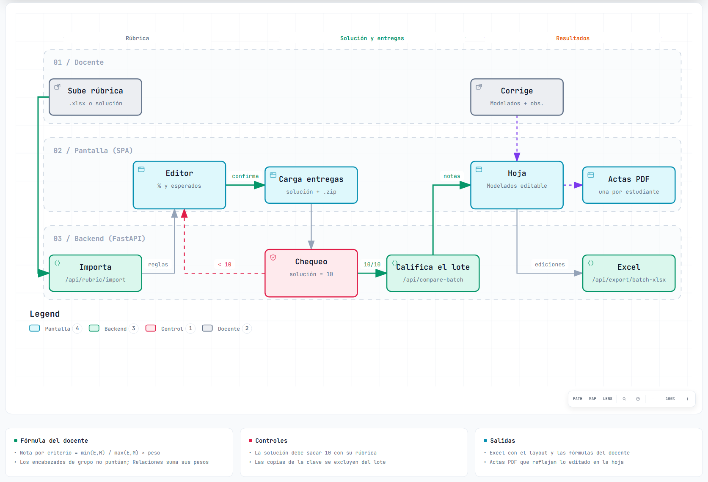
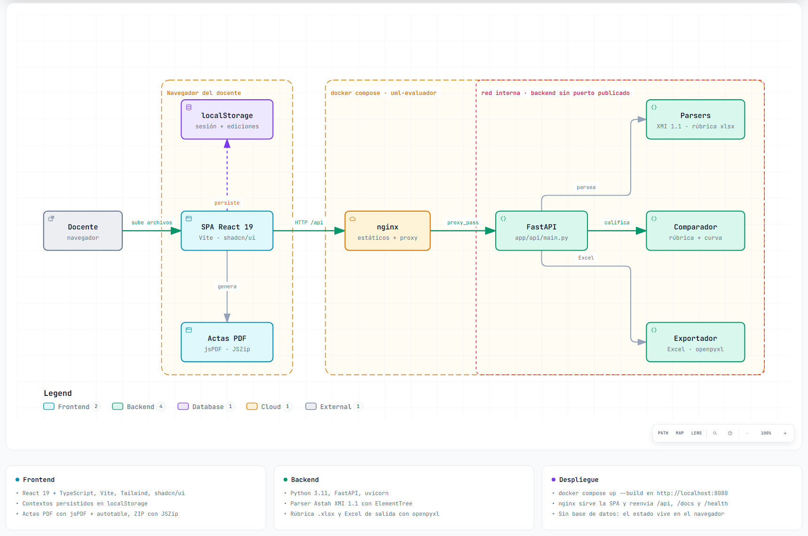
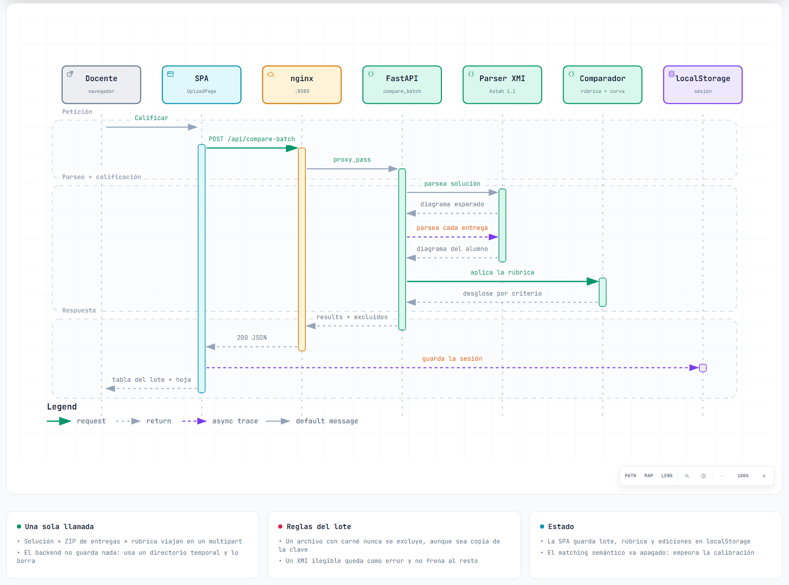

# UML Evaluador

Califica diagramas de clases UML exportados desde **Astah (XMI 1.1)** con la **rúbrica del
docente, en el formato de su propio Excel**. El docente sube su rúbrica, la ajusta, sube la
solución y las entregas del grupo, y obtiene una hoja de calificación idéntica a la suya donde
puede corregir cualquier criterio antes de exportar el Excel de notas y las actas en PDF.

El motor está **calibrado contra 46 entregas reales que el docente ya había calificado a
mano**: error promedio de **0.39 puntos sobre 10**, mediana 0 y **28 de 46 notas idénticas**.

```bash
docker compose up --build
```

Abrir `http://localhost:8080`. No hace falta instalar Python ni Node.

---

## Contenido

- [Flujo del docente](#flujo-del-docente)
- [Arquitectura](#arquitectura)
- [Cómo se califica un lote](#cómo-se-califica-un-lote)
- [Tecnologías](#tecnologías)
- [Estructura del repositorio](#estructura-del-repositorio)
- [Desarrollo sin Docker](#desarrollo-sin-docker)
- [Pruebas y calibración](#pruebas-y-calibración)
- [Reglas de calificación](#reglas-de-calificación)
- [API](#api)
- [Pendientes](#pendientes)
- [Diagramas](#diagramas)
- [Licencia y autores](#licencia-y-autores)

---

## Flujo del docente

<picture>
  <source media="(prefers-color-scheme: dark)" srcset="docs/diagramas/img/flujo-docente.dark.png">
  
</picture>

La pantalla es un asistente de tres pasos:

1. **Rúbrica.** El docente sube su rúbrica `.xlsx` tal como la usa (formato 2EP o Práctica 1).
   Se muestra con la estructura de su hoja: *Clases*, la sección *Relaciones*, cada
   encabezado de relación con sus multiplicidades y las clases de asociación. Ahí ajusta el
   %, las clases esperadas y cada multiplicidad; los pesos deben sumar 100 %. Si no tiene
   Excel, la rúbrica se puede **derivar del XMI de la solución**.
2. **Solución y entregas.** El XMI de la solución y un `.xmi` (un estudiante) o un `.zip`
   (el grupo; el carné se lee del nombre de cada archivo). Antes de calificar, el sistema
   califica **la solución con su propia rúbrica: debe sacar 10**. Si no, avisa qué criterio
   no cuadra y la rúbrica vuelve al editor.
3. **Resultados.** Tabla del grupo en `/lote` y **hoja de calificación** por estudiante en
   `/hoja`. La columna *Modelados* la llena el motor y el docente la corrige donde su criterio
   difiera; la nota se recalcula al instante. De ahí salen el **Excel de notas** (con el layout
   y las fórmulas del docente) y las **actas PDF**, que reflejan lo editado.

La rúbrica, el lote y las correcciones se guardan en el navegador: recargar la página no
pierde el trabajo. Las copias de la solución que vengan en el ZIP sin carné se excluyen del
lote; un archivo con carné nunca se excluye, aunque sea copia de la clave.

## Arquitectura

<picture>
  <source media="(prefers-color-scheme: dark)" srcset="docs/diagramas/img/arquitectura.dark.png">
  
</picture>

| Pieza | Responsabilidad |
|-------|-----------------|
| **SPA** (`app/`) | Asistente de 3 pasos, editor de rúbrica, tabla del lote, hoja de calificación y actas PDF. Todo el estado vive en contextos de React persistidos en `localStorage`. |
| **nginx** (contenedor `frontend`) | Sirve la SPA compilada y reenvía `/api`, `/docs`, `/redoc`, `/openapi.json` y `/health` al backend. Al ser el mismo origen, la app funciona también desde otra máquina de la red (`http://IP-del-equipo:8080`). |
| **FastAPI** (`app/api/`) | `main.py` arma la app y monta los routers de `routes/` (rúbrica, lote, comparaciones, utilidades). Endpoints sin estado: cada petición usa un directorio temporal y lo borra al terminar. No hay base de datos. |
| **Parsers** (`app/parsers/`) | `xmi_parser.py` detecta la versión y delega: `xmi11_parser.py` lee Astah XMI 1.1 (clases realmente dibujadas, clases de asociación, multiplicidades por extremo) y `xmi2_parser.py` el resto. `teacher_rubric_parser.py` lee la rúbrica del docente desde su Excel. |
| **Comparador** (`app/comparator/`) | `class_rubric.py` aplica la rúbrica criterio por criterio con la curva del docente, `min(E,M)/max(E,M) × peso`. `uml_comparator.py` es el núcleo de similitud; casos de uso y secuencia van en sus propios módulos. |
| **Exportador** (`app/exporters/batch_xlsx.py`) | Excel del lote: una hoja de calificación por estudiante en el formato del docente, con fórmulas vivas, más Notas, Detalle y Resumen. |

El backend no publica puerto: solo lo ve nginx dentro de la red de `docker compose`.

## Cómo se califica un lote

<picture>
  <source media="(prefers-color-scheme: dark)" srcset="docs/diagramas/img/calificar-lote.dark.png">
  
</picture>

Un solo `POST /api/compare-batch` lleva la solución, el ZIP de entregas y la rúbrica (como
`evaluation_profile_json`). El backend parsea la solución una vez, descarta las copias de la
clave sin carné, parsea cada entrega y le aplica la rúbrica. Un XMI ilegible queda marcado
como error y no frena al resto. La respuesta trae el desglose por criterio de cada estudiante,
que es lo que alimenta la hoja de calificación.

## Tecnologías

| Capa | Tecnología | Para qué |
|------|------------|----------|
| Frontend | React 19, TypeScript 5.9, Vite 7 | SPA |
| | React Router 7 | Rutas `/`, `/lote`, `/lote/desglose`, `/hoja`, `/resultados`, `/reporte` |
| | Tailwind CSS 3, shadcn/ui (Radix), lucide-react | Interfaz |
| | jsPDF + jspdf-autotable, JSZip | Actas PDF y ZIP de actas, generados en el navegador |
| Backend | Python 3.11, FastAPI, uvicorn, Pydantic 2 | API |
| | `xml.etree.ElementTree` | Parser de XMI, sin dependencias externas |
| | openpyxl | Leer la rúbrica y escribir el Excel de notas |
| | gensim + FastText (opcional) | Matching semántico de nombres; **apagado**, ver [calibración](#pruebas-y-calibración) |
| Entrega | Docker Compose, nginx 1.27, node:22 (build), python:3.11-slim | `docker compose up --build` |
| Pruebas | pytest, Vitest, ESLint | 216 pruebas del backend (incluida la calibración contra las notas reales) y 38 del frontend (la fórmula de la hoja, la rúbrica y las correcciones) |

## Estructura del repositorio

```
.
├── docker-compose.yml            # frontend (nginx :8080) + backend (sin puerto publicado)
├── iniciar.ps1                   # arranque sin Docker en Windows
├── GUIA_DOCENTE.md               # guía de uso para el docente
├── docs/diagramas/               # diagramas de este README (fuente JSON + HTML interactivo)
├── app/                          # frontend
│   ├── Dockerfile, nginx.conf
│   └── src/
│       ├── pages/                # UploadPage, BatchResultsPage, GradingSheetPage, ...
│       ├── components/           # RubricTable, Stepper, report/, results/, diagram/
│       ├── context/              # estado del lote, de la hoja y de la evaluación
│       ├── lib/                  # grading-sheet.ts (la fórmula), teacher-rubric.ts,
│       │                         # report-pdf.ts, persisted-state.ts, api.ts
│       └── types/
└── uml-evaluator/backend/        # backend
    ├── Dockerfile
    ├── app/
    │   ├── api/                  # main.py (la app), schemas.py, uploads.py, evaluation.py
    │   │   └── routes/           # rubric.py, batch.py, compare.py, tools.py
    │   ├── parsers/              # xmi_parser.py (fachada), xmi11_parser.py (Astah),
    │   │                         # xmi2_parser.py, teacher_rubric_parser.py
    │   ├── comparator/           # uml_comparator.py (núcleo), class_rubric.py (la rúbrica),
    │   │                         # usecase_comparison.py, sequence_comparison.py,
    │   │                         # rubric_builder.py, rubric_check.py, calibracion.py
    │   └── exporters/batch_xlsx.py
    ├── scripts/                  # reporte_calibracion.py, build_calibracion_fixture.py
    ├── test_files/               # calibracion/ (46 entregas reales), rubricas/ (2EP)
    └── tests/
```

## Desarrollo sin Docker

Requisitos: Python 3.11+ y Node.js 22+.

En Windows, desde la raíz:

```powershell
.\iniciar.ps1
```

Deja el backend en `http://localhost:8000` y el frontend en `http://localhost:5173`. A mano:

```bash
cd uml-evaluator/backend
python -m venv venv
venv\Scripts\activate            # macOS/Linux: source venv/bin/activate
pip install -r requirements.txt
python run.py
```

```bash
cd app
npm install
npm run dev
```

Con `npm run dev` el frontend llama a `http://localhost:8000`. En la imagen de Docker se
compila con `VITE_API_URL` vacío (mismo origen) y `--base=/`; ver `app/src/lib/api.ts`
antes de cambiar cualquiera de los dos.

Después de cambiar código con Docker ya levantado:

```bash
docker compose up -d --build --force-recreate
```

## Pruebas y calibración

```bash
cd uml-evaluator/backend
python -m pytest
```

```bash
cd app
npm test          # Vitest: la fórmula de la hoja, la rúbrica y las correcciones
npm run lint
```

`tests/test_calibracion_docente.py` califica las 46 entregas de la Práctica 1 (4 turnos) con
la rúbrica del docente y exige que el sistema se parezca a sus notas: error promedio ≤ 0.5,
≥ 65 % dentro de ±0.5, ≥ 85 % dentro de ±1.0, peor caso ≤ 2.5 y sin sesgo. El reporte
alumno por alumno:

```bash
python scripts/reporte_calibracion.py                  # tal como califica la pantalla
python scripts/reporte_calibracion.py --con-semantica  # con matching semántico, para comparar
```

Resultado actual: error promedio 0.393, mediana 0, 28/46 idénticas, 34/46 dentro de ±0.5 y
41/46 dentro de ±1.0. Con matching semántico (FastText) el error sube a 0.480, por eso va
apagado y la imagen de Docker no incluye `gensim`.

La rúbrica de cada turno se lee con `teacher_rubric_parser`, el mismo que usa
`POST /api/rubric/import` cuando el docente sube su Excel: la calibración mide el camino
real de la pantalla (`scripts/build_calibracion_fixture.py` regenera la fixture).

## Reglas de calificación

```
nota ponderada = min(Esperados, Modelados) / max(Esperados, Modelados) × peso
nota final     = Σ notas ponderadas        (pesos en %, sobre 10)
```

La curva es simétrica: modelar de más penaliza igual que modelar de menos. Los encabezados
de grupo (*Asociación X - Y*, *Agregación*, *Composición*) no puntúan; *Relaciones* es la
suma de los pesos de su sección.

Reglas medidas contra las notas reales del docente:

- Un extremo sin multiplicidad **equivale a `1`**: es el implícito de UML y así lo exporta
  Astah cuando no se dibuja nada.
- *Clases* cuenta las clases **dibujadas en el diagrama**, no las que existen en el archivo
  (Astah embebe tipos del JDK y conserva clases borradas del lienzo).
- Se acepta agregación o composición donde se pedía asociación, y asociación o composición
  donde se pedía agregación. Donde se pedía composición solo vale composición o agregación.
- Los nombres de la rúbrica se emparejan **uno a uno** con las clases del estudiante, para
  que `Ganado` no se lleve a `Ganadero` y deje `CabezaGanadoVacuno` sin dueño.
- Una `AssociationClass` real cuenta aunque el estudiante le haya puesto otro nombre.

El detalle de cada criterio y de la API está en
[`uml-evaluator/README.md`](uml-evaluator/README.md).

## API

Documentación interactiva en `http://localhost:8080/docs`. Los endpoints que usa la pantalla:

| Método | Ruta | Qué hace |
|--------|------|----------|
| `POST` | `/api/rubric/import` | Lee la rúbrica del Excel del docente |
| `POST` | `/api/rubric/from-solution` | Deriva la rúbrica del XMI de la solución |
| `POST` | `/api/rubric/check` | Califica la solución con su rúbrica (debe dar 10) |
| `POST` | `/api/compare-batch` | Solución + ZIP de entregas + rúbrica → una fila por estudiante |
| `POST` | `/api/export/batch-xlsx` | Excel del lote con las correcciones de la hoja |
| `GET` | `/health` | Estado del servicio |

Todas las respuestas llevan el encabezado `X-Desarrollado-Por: davlillos`.

## Pendientes

Lo que no depende del código:

| # | Qué | Qué falta |
|---|-----|-----------|
| 1 | **El Turno 3 (2EP) no está calibrado.** La rúbrica se lee bien y la solución saca 10, pero no hay notas a mano del docente para comparar. | Sus notas del 2EP. Con ellas se agrega el turno a `test_files/calibracion/` y corre el mismo test. |
| 2 | **¿Una asociación donde se pedía composición vale?** Hoy no: no hubo notas suyas con qué medirlo. En el Turno 3 afecta a 12 estudiantes (4 de la clave impar, 8 de la par), con hasta 1 punto cada uno; CC26044 pasaría de 5.50 a 6.50 como máximo. | Decisión del docente. Es una línea en `RELATIONSHIP_TYPE_COMPATIBILITY` (`comparator/class_rubric.py`); mientras tanto, se corrige a mano en la hoja. |
| 3 | **Datos reales en el repositorio.** `test_files/calibracion/` tiene XMI de estudiantes y las notas del docente. | Si el repositorio se publica, anonimizarlos. |

Decisiones tomadas:

- **Sin autenticación.** La app corre en la PC del docente o en su red local; no se expone a
  internet.
- **Endpoints sin pantalla.** `/api/compare*`, `/api/parse`, `/api/rubric/parse` y
  `/api/rubric-template` (`routes/compare.py`, `routes/tools.py`) no los usa el flujo del
  docente; quedan para integraciones y pruebas desde `/docs`. Ahí vive también la evaluación
  de diagramas de casos de uso y de secuencia.

## Diagramas

Los diagramas de este README se hicieron con [archify](https://github.com/tt-a1i/archify).
En `docs/diagramas/` están:

- `*.json`: la fuente de cada diagrama (arquitectura, flujo y secuencia).
- `*.html`: la versión interactiva. Abrirla en el navegador permite zoom, vistas guiadas,
  modo claro/oscuro y exportar a PNG/SVG. Los controles del visor están en inglés: archify
  solo trae interfaz en inglés y chino.
- `img/*.png`: las capturas que se ven arriba, en tema claro y oscuro.

Para regenerar uno después de editar su JSON (con el repositorio de archify clonado):

```bash
node archify/bin/archify.mjs deliver architecture docs/diagramas/arquitectura.architecture.json docs/diagramas/arquitectura.html --quality showcase
```

Los tres pasan la validación `showcase` de archify (9/9 comprobaciones, sin errores ni
advertencias) y el chequeo en navegador a 1440×900, 1600×1000, 1920×1080 y 2048×1320.

## Licencia y autores

MIT — ver [`LICENSE`](LICENSE). Se puede usar, copiar y modificar con una condición:
conservar el aviso de copyright de **davlillos** en toda copia o parte sustancial del código.
Cada archivo fuente lo lleva en su encabezado (`SPDX-FileCopyrightText: 2026 davlillos`).

Desarrollado por **davlillos** ([`AUTHORS.md`](AUTHORS.md)):

- Sergio David Hernández García
- Marcos Gallardo
- Karla Gissell Girón Martinez

Escuela de Sistemas Informáticos — Facultad de Ingeniería y Arquitectura, Universidad de
El Salvador.
